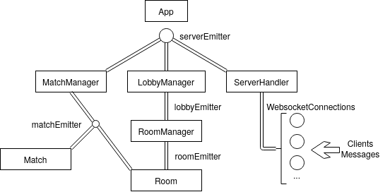

# LULChess Server Implementation

---
---

## Documentation

---

## 1. API Documentation

---

### Sends

- `"uID"`, sent when connection is stablished.

    This message is followed by the user session ID - string.

- `"activeRooms"`, as an aswer to `"getActiveRooms"`.

    This message is followed by an array of objects. Each object contains
    information of each active room.

- `"createdRoom"`, as an answer to `"createMatch"`.

    This message is followed by the roomID of the room created - int.

- `"notCreated"`, as an answer to `"createMatch"`.

    This message is sent by itself. It signals the client that it could not
    create the desired room. It usually indicates that the server is full.

- `"leftRoom"`, as an answer to `"leaveRoom"`.

    This message is sent by itself. It signals the client that it succesfully
    left the room, allowing it to join another.

- `"joined"`, as an answer to `"tryJoin"`.

    This message is followed by the roomID of the room the client joined - int.

- `"notJoin"`, as an answer to `"tryJoin"`.

    This message is sent by itself. It signals that there was a problem joining
    the requested room. Usually it means the room became full or was deleted in
    the meantime.

- `"matchStarted"`, when client is in a room that the match started.

    This message is sent together with the list of players IDs, and the color
    (white or black) of the player.

    It is important to notice that this may be sent before the `"joined"` or
    even the `"created"` base replies.

---

### Interprets

- `"getPieces"`: The client asks for the pieces available for matches.

    Supply the pieces and their actions in order to allow client implementions
    to provide in-match features. One example is showing where each piece can
    move in a given state.

- `"createMatch"`: The client submits a form containing match params and asks
    for a room.

- `"getActiveRooms"`: The client requests a list of active room.

    This allows the client to display a lobby.

- `"leaveRoom"`: The client tells it left the current room.

- `"tryJoin"`: The client submits a roomID and asks to join the respective
    room

---
---

## 2. Handling Client Requests

